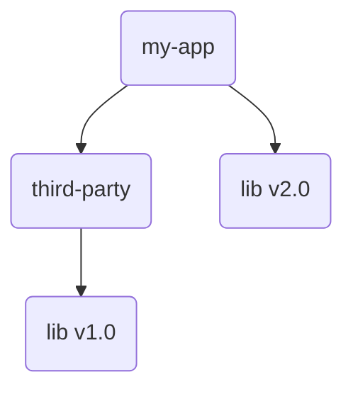
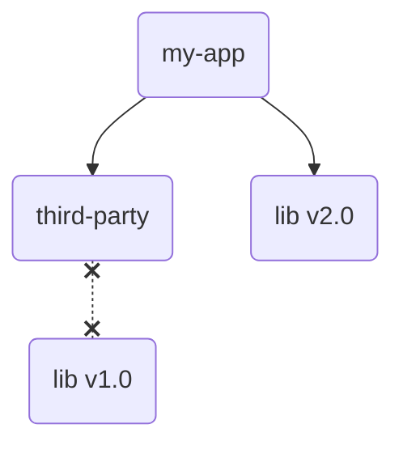
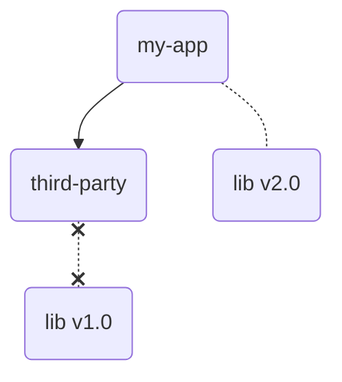
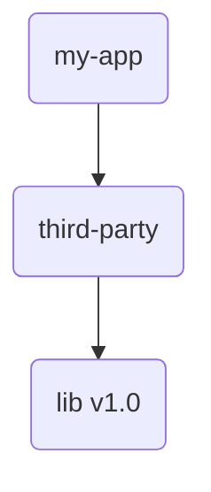
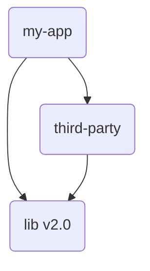
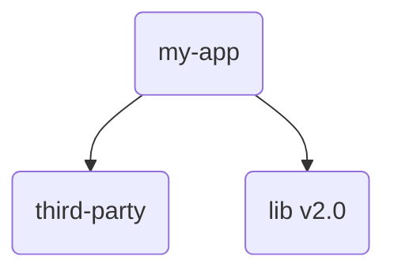

# Eliminate useless exclusions from your maven project

## Usage
The usual maven plugin usage rules apply

### CLI

`mvn nyub:redundant-exclusions-maven-plugin:0.0.1:redundant-exclusions`

### POM
```xml
      <plugin>
        <groupId>io.github.nyub</groupId>
        <artifactId>redundant-exclusion-maven-plugin</artifactId>
        <version>${plugin.version}</version>
        <executions>
          <execution>
            <goals>
              <goal>redundant-exclusions</goal>
            </goals>
          </execution>
        </executions>
      </plugin>
```


## Motivation

### Usual maven 'exclusion' purpose

Consider a usual [dependency conflict](https://maven.apache.org/enforcer/enforcer-rules/dependencyConvergence.html). Here both `my-app` and one of its dependencies `third-party` depend on the same `lib` but with different versions.



One way to solve this is to exclude `lib` from transitively included `third-party` dependencies.

```xml
<dependency>
    ...
    <artifactId>third-party</artifactId>
    <exclusions>
        <exclusion>
            ...
            <artifactId>lib</artifactId>
        </exclusion>
    </exclusions>
</dependency>
```



### Problematic cases

Dependency exclusion is fine, but as the project evolves and the pom surface grows, it can lead to subtle problems when you shuffle your dependencies.

#### Completely erasing a dependency

From the [base example](#usual-maven-exclusion-purpose), consider what happens if you do not use `lib` directly anymore



Now at runtime, the `lib` classes required by `third-party` will be totally absent, leading to a dreaded [ClassNotFoundException](https://docs.oracle.com/en/java/javase/22/docs/api/java.base/java/lang/ClassNotFoundException.html) !

The way to solve this is to remove the now unnecessary exclusion from `third-party`, restoring a sound dependency tree.



### Excluding a dependency without version conflict

This one is less 'risky' and more of a maintenance issue, since it only adds unnecessary noise to your pom.

From the [base example](#usual-maven-exclusion-purpose), consider that, e.g. after upgrading, `third-party` now depends on the same version of `lib`.



You've done it, you achieved **dependency convergence**, hurrah. But this `<exclusion>` section stills hangs there in your pom, and soon(sooner than you think) noone will remember why it is here.

### Excluding a dependency that does not exist

This one is a special case of [excluding a dependency without conflict](#excluding-a-dependency-without-version-conflict), and leads to the same noise problem.

From the [base example](#excluding-a-dependency-without-version-conflict), consider that after upgrading, `third-party` does not even depend on `lib` anymore.



The `<exclusion>` section for `third-party` is now completely useless.